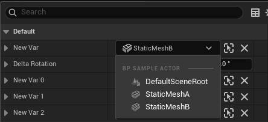
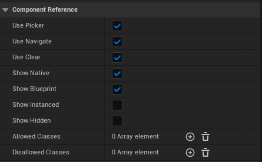
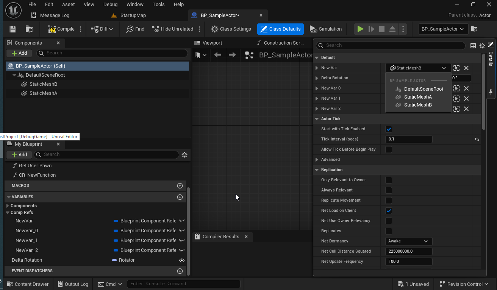

## Blueprint Component Reference Plugin for Unreal Engine

Blueprint Component Reference Plugin provides a struct and set of accessors that allow referencing actor components from blueprint editor details view with a component picker, it is designed to 'identify' local context and build list of components for chosing. 

## Features

`FBlueprintComponentReference` supported in following use cases:
 * Actor or ActorComponent class member UPROPERTY 
 * Struct member UPROPERTY that is used as Actor or ActorComponent member UPROPERTY
 * Blueprint local variable of Actor or ActorComponent class.
 * Blueprint Function local variable within Actor or ActorComponent class.
 * Array in one of above
 * Map value in one of above
 
## Customizations

Component reference property display can be customized with UPROPERTY meta specifiers.
 
Component Filtering:
 * `AllowedClasses` - List of classes for component filter
 * `DisallowedClasses` - List of classes for component filter
 * `ShowBlueprint` - Include blueprint SCS components in picker. Default = True.
 * `ShowNative` - Include native components in picker. Default = True.
 * `ShowInstanced` - Include instanced (runtime) components in picker. Default = True.
 * `ShowPathOnly` - Include components without property in picker. Default = False.

Item Display: 
 * `NoClear` - Hide 'Clear' button. Default = False.
 * 'NoNavigate' - Hide 'Navigate to' button. Default = False.
 * 'NoPicker' - Disable component picker. Default = False.
 
Blueprint variables supported via variable editor extension.

 
 
## Unreal Engine Versions

Plugin is compatible with 5.0+, ue5-main and can be modified to work with other engine versions.

## Examples

Examples can be found in `BCRTestActor.h`

