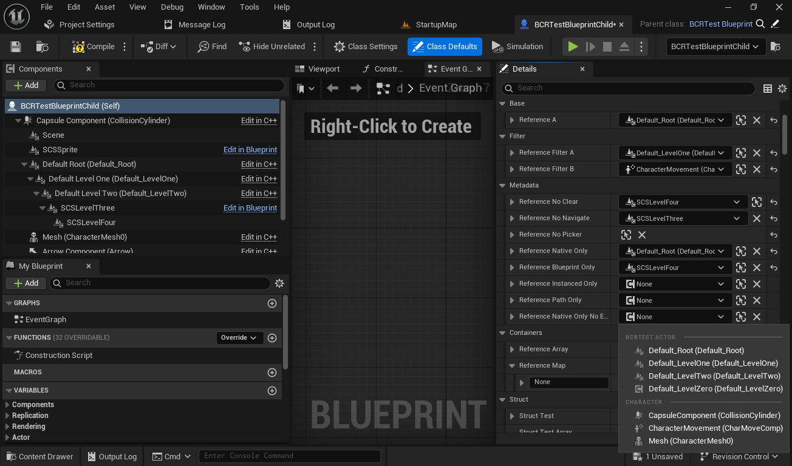
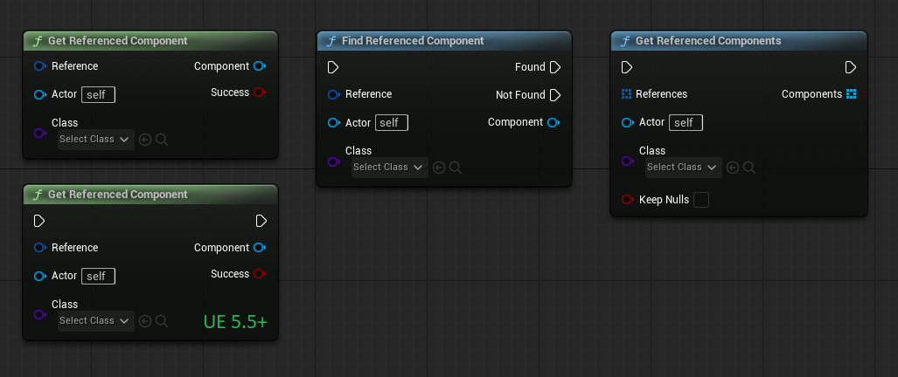

## Blueprint Component Reference Plugin for Unreal Engine

Blueprint Component Reference Plugin provides a struct and set of accessors that allow referencing actor components from blueprint editor details view with a component picker, it automatically identifies context and builds list of components for selection menu. 


## Features

Plugin provides component picker in following use cases:
 * Actor class member UPROPERTY 
 * Struct member UPROPERTY within Actor class or blueprint.
 * Local variable in an Actor Blueprint.
 * Function local variable in an Actor Blueprint.
 * Data Asset member UPROPERTY (if ActorClass meta specifier is used).
 * Data Asset Blueprint variable (if ActorClass meta specifier is used).
 * Array in one of above
 * Map value in one of above
 
## Component Selection Customizations

Component reference property display can be customized with UPROPERTY meta specifiers.
 
Component Filtering:
 * `AllowedClasses` - List of classes for component filter
 * `DisallowedClasses` - List of classes for component filter
 * `ShowBlueprint` - Include blueprint SCS components in picker. Default = True.
 * `ShowNative` - Include native components in picker. Default = True.
 * `ShowInstanced` - Include instanced (runtime) components in picker. Default = True.
 * `ShowHidden` - Include internal or hidden components without direct property in picker. Default = False.
 * `ShowEditor` - Include editor-only components in picker. Default = True.

Item Display: 
 * `NoClear` - Hide 'Clear' button. Default = False.
 * `NoNavigate` - Hide 'Navigate to' button. Default = False.
 * `NoPicker` - Disable component picker. Default = False.

Out-of-Actor Use:
* `ActorClass` - Class to use for component selection dropdown if context detection is not possible.

Blueprint variables supported via variable editor extension.


 
 
## Unreal Engine Versions

Plugin is compatible with 5.0+, ue5-main and can be modified to work with other engine versions.

## Examples

```c++

UCLASS()
class ABCRTestActor : public AInfo
{
	GENERATED_BODY()
public:
    /* Simplest reference to any component within current class */
    UPROPERTY(EditAnywhere, BlueprintReadOnly)
    FBlueprintComponentReference SimpleReference;
    
    /* Simplest reference to any native component within current class */
    UPROPERTY(EditAnywhere, BlueprintReadOnly, meta=(ShowNative=true, ShowBlueprint=false, ShowInstanced=false))
    FBlueprintComponentReference NativeOnlyReference;
    
    /* Simplest reference to any component within current class */
    UPROPERTY(EditAnywhere, BlueprintReadOnly, meta=(AllowedClasses="/Script/Engine.SceneComponent"))
    FBlueprintComponentReference SimpleSceneCompReference;
};

UCLASS()
class UBCRTestDataAsset : public UDataAsset
{
	GENERATED_BODY()
public:
    /* Make a reference to any component within a BCRTestActor class */
    UPROPERTY(EditAnywhere, meta=(ActorClass="/Script/BlueprintComponentReferenceTests.BCRTestActor"))
    FBlueprintComponentReference ExternalRef;
};

void AMyActor::Foo()
{
    if (auto* Component = Reference.GetComponent<UBCRActorComponent>(this))
    {
        Component->Activate();
    }
}

```

Code examples can be found in `BCRTestActor.h`

Editor View:



Details View:


Graph Nodes:



Example use:


